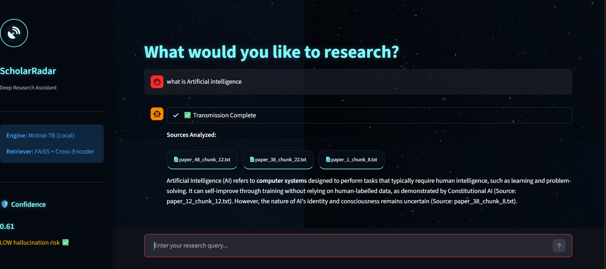

# ScholarRadar – RAG-Based Research Assistant

ScholarRadar is a research assistant built using a Retrieval-Augmented Generation (RAG) pipeline. It is designed to answer questions from a collection of research papers while reducing hallucinations and improving reliability.

The idea behind this project was to move beyond simple chatbot-style responses and build a system that actually grounds its answers in real documents and shows how reliable those answers are.

---

## What this project does

This system allows users to ask questions related to research papers and generates answers based on relevant content retrieved from those papers.

Instead of relying only on a language model, it follows a structured pipeline:
- retrieves relevant document chunks
- filters them using a re-ranking model
- generates an answer using a local LLM
- evaluates how grounded the answer is

---

## How it works

The system is built in multiple stages:

1. **Data Preparation**
   - Research papers (PDFs) are converted into text
   - Text is split into smaller chunks
   - Each chunk is converted into embeddings
   - Stored in a FAISS vector database

2. **Retrieval**
   - User query is converted into an embedding
   - FAISS retrieves top 50 similar chunks

3. **Re-ranking**
   - A cross-encoder model re-ranks the retrieved chunks
   - Top 3 most relevant chunks are selected

4. **Context Construction**
   - Chunks are cleaned (remove citations, noise)
   - Only important portions are used

5. **Answer Generation**
   - Mistral 7B (via Ollama) generates the answer
   - Prompt ensures:
     - no hallucination
     - no copying
     - clear explanation

6. **Hallucination Detection**
   - Answer is compared with context using embeddings
   - Cosine similarity is calculated
   - Provides a confidence score

---

## Key Features

- Dual-stage retrieval (FAISS + Cross-Encoder)
- Local LLM (Mistral 7B via Ollama)
- Context filtering for better accuracy
- Source attribution for transparency
- Hallucination detection with confidence score
- Clean UI for interaction

---

## Tech Stack

- Python  
- FAISS  
- SentenceTransformers  
- Cross-Encoder (MS MARCO MiniLM)  
- Ollama  
- Mistral 7B  
- Streamlit  

---


## Project Structure

```
rag_project/
│
├── src/
│   ├── app.py
│   ├── rag_pipeline.py
│   ├── retriever.py
│   ├── hallucination.py
│   ├── chunking.py
│   ├── embeddings.py
│   ├── pdf_to_text.py
│   ├── vector_db.py
│
├── data/
│   ├── chunks/
│   ├── faiss_index.index
│   ├── file_names.npy
│
├── README.md
├── requirements.txt
├── .gitignore
```
---

## How to Run

1. Clone the repository:

```
git clone https://github.com/Amaanzz/rag_project.git
cd rag_project
```

2. Install dependencies:

```
pip install -r requirements.txt
```

3. Install and setup Ollama:

```
ollama pull mistral
```

4. Run the app:

```
streamlit run src/app.py
```
## Application Preview

Below is a snapshot of ScholarRadar in action. The interface shows the query, retrieved sources, generated answer, and hallucination confidence score.

<p align="center">
  
</p>
